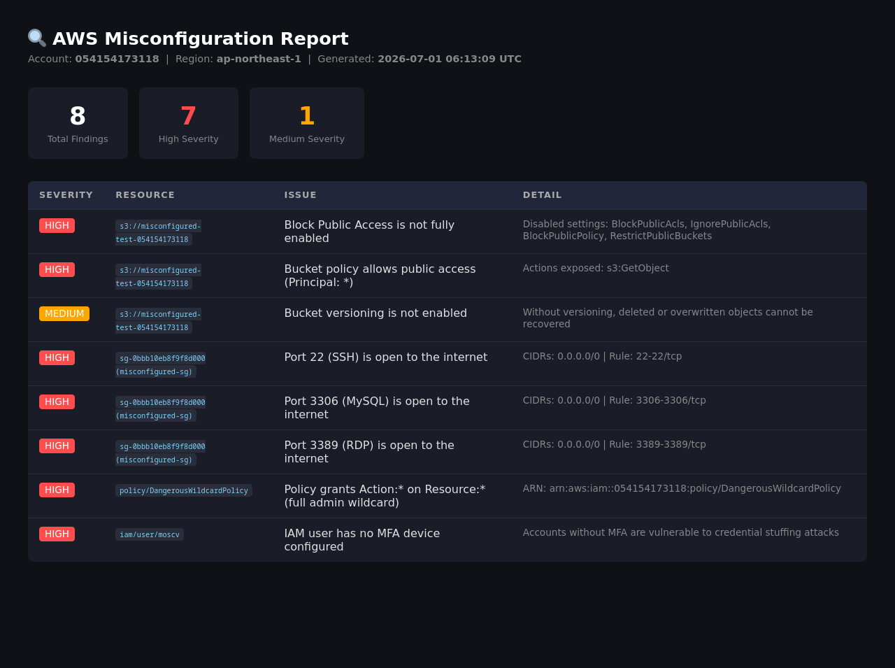
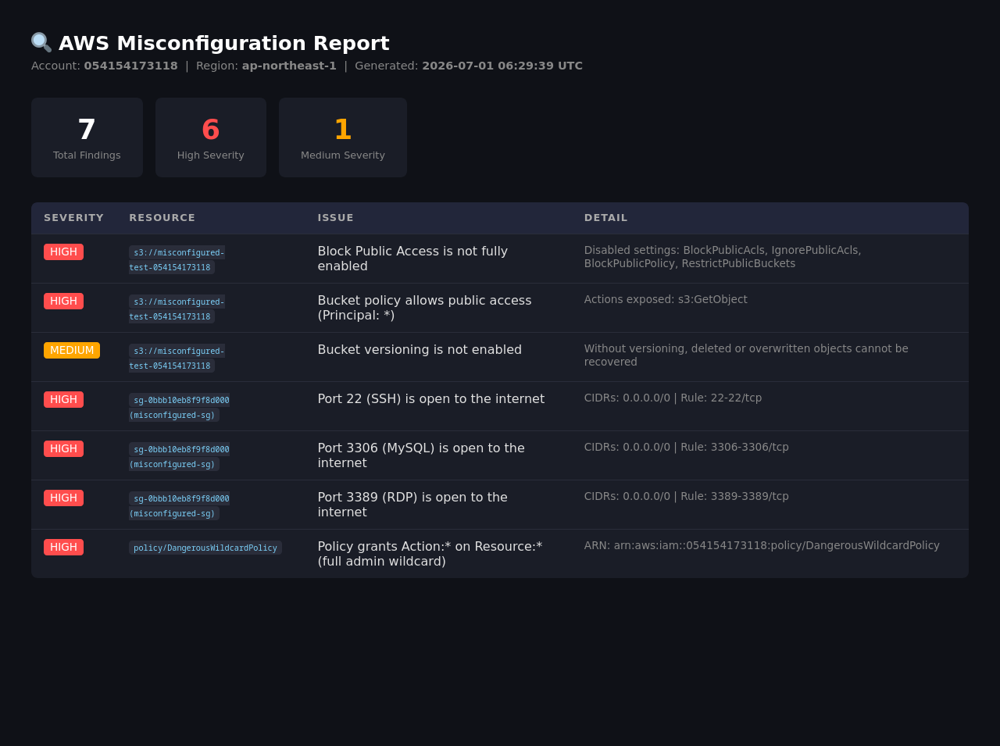

# 🔍 Cloud Misconfiguration Scanner

A Python CLI tool that audits an AWS account for common security misconfigurations. Built with [Boto3](https://boto3.amazonaws.com/v1/documentation/api/latest/index.html), the AWS SDK for Python.

---

## 📋 What It Checks

| Check | Severity | Description |
|---|---|---|
| S3 Block Public Access disabled | 🔴 HIGH | Bucket has public access controls turned off |
| S3 public bucket policy | 🔴 HIGH | Bucket policy allows `Principal: *` (anyone) |
| S3 versioning disabled | 🟡 MEDIUM | Objects cannot be recovered if deleted/overwritten |
| Security group: sensitive port open | 🔴 HIGH | Ports 22, 3389, 3306, etc. open to `0.0.0.0/0` |
| Security group: all traffic open | 🔴 HIGH | Inbound rule allows all protocols from the internet |
| IAM wildcard policy | 🔴 HIGH | Customer-managed policy grants `Action: *` on `Resource: *` |
| IAM user without MFA | 🔴 HIGH | Console user has no MFA device configured |
| IAM access key age > 90 days | 🟡 MEDIUM | Long-lived credentials increase exposure window |

---

## 🚀 Quick Start

### Prerequisites

- Python 3.8+
- AWS account with credentials configured (`aws configure`)
- IAM permissions: `s3:*`, `ec2:DescribeSecurityGroups`, `iam:List*`, `iam:Get*`

### Install

```bash
git clone https://github.com/YOUR_USERNAME/cloud-misconfig-scanner.git
cd cloud-misconfig-scanner

python3 -m venv venv
source venv/bin/activate   # Windows: venv\Scripts\activate

pip install -r requirements.txt
```

### Run

```bash
# Full scan — terminal output
python scanner.py

# Scan a specific region
python scanner.py --region us-east-1

# Run only selected checks
python scanner.py --checks s3 iam

# Export an HTML report
python scanner.py --output html

# Export a JSON report (for piping into other tools)
python scanner.py --output json
```

---

## 📊 Sample Output

```
╔═══════════════════════════════════════════════╗
║       Cloud Misconfiguration Scanner          ║
║       AWS Security Audit Tool                 ║
╚═══════════════════════════════════════════════╝

  Account : 054154173118
  Region  : ap-northeast-1
  Started : 2026-07-01 06:12:27 UTC

────────────────────────────────────────────────
  [1/3] Scanning S3 Buckets...
────────────────────────────────────────────────
  Found 1 bucket(s). Checking each...

  🔴  [HIGH] s3://misconfigured-test-bucket
       Block Public Access is not fully enabled
       → Disabled settings: BlockPublicAcls, IgnorePublicAcls, BlockPublicPolicy, RestrictPublicBuckets

  🔴  [HIGH] s3://misconfigured-test-bucket
       Bucket policy allows public access (Principal: *)
       → Actions exposed: s3:GetObject

════════════════════════════════════════════════
  TOTAL FINDINGS : 8
  🔴 HIGH        : 7
  🟡 MEDIUM      : 1
════════════════════════════════════════════════
```

### Before — 8 findings including MFA warning


### After — MFA configured, finding resolved


---

## 🗂 Project Structure

```
cloud-misconfig-scanner/
├── scanner.py              # Entry point — CLI args, orchestration, summary
├── requirements.txt
├── .gitignore
└── scanners/
    ├── s3_scanner.py       # S3 bucket checks
    ├── sg_scanner.py       # EC2 security group checks
    ├── iam_scanner.py      # IAM policy, MFA, and access key checks
    └── report.py           # JSON and HTML report generation
```

---

## 💡 Design Decisions

**Modular scanners** — each service (S3, EC2, IAM) is a separate module. Adding a new check (e.g. CloudTrail logging disabled, RDS public snapshots) means adding one file without touching the core.

**Least-privilege friendly** — the tool only calls read-only AWS APIs (`List*`, `Get*`, `Describe*`). It never modifies resources.

**Pagination handled** — all list calls use AWS paginators, so the tool works correctly on accounts with hundreds of buckets, users, or security groups.

**Graceful error handling** — `ClientError` is caught per-resource so a permissions gap on one bucket doesn't abort the entire scan.

---

## 🔒 Security Notes

- Never commit AWS credentials. The `.gitignore` excludes `~/.aws/`, `.env`, and any `*.csv` key exports.
- This tool is read-only — it audits and reports, it does not remediate.
- Designed for use in personal/sandbox accounts. In production environments, scope IAM permissions tightly to only the APIs listed above.

---

## 🗺 Roadmap

- [ ] CloudTrail: detect logging disabled per region
- [ ] RDS: public snapshots and instances
- [ ] S3: server-side encryption not enforced
- [ ] Output: CSV format
- [ ] Multi-region scan in one pass

---

## 🛠 Built With

- [Python 3](https://www.python.org/)
- [Boto3](https://boto3.amazonaws.com/v1/documentation/api/latest/index.html) — AWS SDK for Python
- AWS Free Tier (S3, EC2, IAM)

---

## 📄 License

MIT
